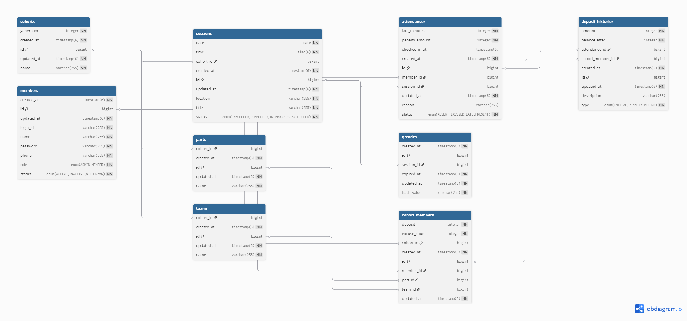

# 🗂️ Entity Relationship Diagram (ERD)

프로그라피 출결 관리 시스템의 데이터베이스 모델링 구조입니다.
데이터 무결성을 보장하고, 확장성을 고려하여 **정규화**된 설계를 적용했습니다.

## 1. ERD Diagram

---

## 2. 주요 엔티티 설명 (Key Entities)

### 👥 회원 및 기수 관리 (Member & Cohort Organization)

회원, 기수, 그리고 조직(파트/팀) 정보를 체계적으로 관리하기 위해 테이블을 분리했습니다.
특히 **`parts`와 `teams`를 별도 엔티티로 분리**하여, 기수별 조직 구조가 변경되더라도 유연하게 대응할 수 있습니다.

| Table                | Description                                                       | Key Fields                                                   |
|:---------------------|:------------------------------------------------------------------|:-------------------------------------------------------------|
| **`members`**        | 시스템을 사용하는 모든 사용자의 기본 정보를 저장합니다.                                   | `id`, `login_id`, `name`, `role`                             |
| **`cohorts`**        | 프로그라피의 기수 정보를 관리합니다.                                              | `id`, `generation` (11기, 12기 등)                              |
| **`parts`**          | 각 기수에 소속된 파트(Server, Web, iOS 등) 정보를 관리합니다.                       | `id`, `cohort_id`, `name`                                    |
| **`teams`**          | 각 기수 내에서 구성된 팀 프로젝트 정보를 관리합니다.                                    | `id`, `cohort_id`, `name`                                    |
| **`cohort_members`** | 회원과 기수 간의 연결 테이블입니다. 회원이 해당 기수에서 어떤 **파트**와 **팀**에 소속되었는지를 매핑합니다. | `id`, `member_id`, `cohort_id`, **`part_id`**, **`team_id`** |

### 📅 일정 및 출결 (Session & Attendance)

출석 체크의 정확성을 높이고, 부정 출석을 방지하기 위한 QR 코드 기반의 프로세스를 데이터 모델에 반영했습니다.

| Table             | Description                                                 | Key Fields                                                 |
|:------------------|:------------------------------------------------------------|:-----------------------------------------------------------|
| **`sessions`**    | 특정 기수에서 진행하는 일정(모임) 정보를 저장합니다.                              | `id`, `cohort_id`, `title`, `date`, `status`               |
| **`attendances`** | 회원의 세션별 출석 상태를 기록합니다. 지각 시간(`late_minutes`)과 페널티 금액을 포함합니다. | `id`, `session_id`, `member_id`, `status`, `checked_in_at` |
| **`qrcodes`**     | 일정 출석을 위한 1회성/시간제한 인증 토큰을 관리합니다. 출석 정보와 대응됩니다.              | `id`, `session_id`, `hash_value`, `expired_at`             |

### 💰 보증금 관리 (Deposit History)

출결 상태 변경에 따른 보증금 차감 및 환급 내역을 투명하게 관리하기 위해 이력(History) 테이블을 별도로 구성했습니다.

| Table                   | Description                                                      | Key Fields                                                  |
|:------------------------|:-----------------------------------------------------------------|:------------------------------------------------------------|
| **`deposit_histories`** | 보증금 변동 내역(차감/환급)을 기록합니다. 변동 원인이 된 출석 정보(`attendance_id`)와 연결됩니다. | `id`, `cohort_member_id`, `attendance_id`, `amount`, `type` |

---

## 3. 데이터 모델링 특징 (Design Considerations)

### 3.1. 정규화 (Normalization)

* **조직 구조 분리**: `Part`와 `Team`을 `CohortMember`의 단순 문자열 필드로 두지 않고 별도 테이블로 분리했습니다. 이는 팀명이나 파트명이 변경되거나, 동일한 이름의 파트가 여러 기수에
  존재할 때 데이터 중복을 막고 관리를 용이하게 합니다.
* **이력 추적**: `CohortMember`를 통해 회원이 기수마다 다른 파트나 팀에 속했던 이력을 명확히 구분할 수 있습니다.

### 3.2. 데이터 무결성 (Integrity)

* **Foreign Key 제약 조건**: `cohort_members`는 `parts`와 `teams`를 참조함으로써, 존재하지 않는 파트나 팀에 회원이 배정되는 것을 DB 레벨에서 방지합니다.
* **Enum 활용**: `Role`, `SessionStatus`, `AttendanceStatus` 등 상태값은 Enum으로 관리하여 애플리케이션 로직과의 정합성을 보장합니다.

---

## 4. 연관관계 매핑 (JPA Relationships)

애플리케이션(Spring Data JPA) 레벨에서 엔티티 간의 관계를 다음과 같이 정의했습니다.
모든 `XToOne` 관계는 지연 로딩(`FetchType.LAZY`)으로 설정하여 불필요한 쿼리 발생을 방지했습니다.

### 4.1. 회원 및 조직 (Member & Organization)

* **Member** `(1)` ↔ `(N)` **CohortMember**
    * 회원은 여러 기수에 참여할 수 있으며, 기수별 활동 이력을 가집니다.
* **Cohort** `(1)` ↔ `(N)` **CohortMember**
    * 하나의 기수에는 여러 회원이 소속됩니다.
* **Cohort** `(1)` ↔ `(N)` **Part** / **Team**
    * 기수가 생성될 때 파트와 팀이 구성되며, 이는 기수의 라이프사이클에 종속됩니다 (`CascadeType.ALL`).
* **Part / Team** `(1)` ↔ `(N)` **CohortMember**
    * 각 파트와 팀에는 여러 회원이 배정됩니다.

### 4.2. 출결 및 세션 (Attendance & Session)

* **Cohort** `(1)` ↔ `(N)` **Session**
    * 기수는 커리큘럼에 따라 여러 번의 일정을 진행합니다.
* **Session** `(1)` ↔ `(N)` **Qrcode**
    * 하나의 일정은 인증을 위한 여러 개의 QR 코드를 가지며, 하나의 QR 코드만 활성화됩니다.
* **Session** `(1)` ↔ `(N)` **Attendance**
    * 일정이 생성되고, 해당 세션에 대한 출석 데이터를 보관할 수 있습니다.
* **Member** `(1)` ↔ `(N)` **Attendance**
    * 회원은 일정마다 하나의 출석 상태(출석/결석/지각 등)를 가집니다.

### 4.3. 보증금 (Deposit)

* **CohortMember** `(1)` ↔ `(N)` **DepositHistory**
    * 회원의 보증금 변동 내역(차감/환급)은 기수 활동 기간 동안 누적 기록됩니다.
* **Attendance** `(1)` ↔ `(N)` **DepositHistory**
    * 특정 출석 상태(예: 무단 결석)가 원인이 되어 보증금 변동 내역이 생성됩니다.

---

## 5. 스키마 관리 전략 (Schema Management)

본 프로젝트는 데이터베이스 스키마의 변경 이력을 투명하게 관리하고, 배포 환경 간의 정합성을 보장하기 위해 **Flyway**를 도입했습니다.

### 🛠️ Flyway 도입 이유

1. **형상 관리 (Version Control)**:
    * 코드뿐만 아니라 DB 스키마 변경 사항(`V1__init.sql`, `V2__add_column.sql` 등)도 Git으로 관리하여 변경 추적을 용이하게 했습니다.
2. **환경 간 일관성 (Consistency)**:
    * 로컬(H2), 개발, 운영(RDS) 등 어떤 환경에서도 애플리케이션 실행 시점에 동일한 스키마 버전을 보장합니다.
3. **협업 및 배포 안정성**:
    * 여러 개발자가 동시에 스키마를 변경할 때 발생할 수 있는 충돌을 방지하고, CI/CD 파이프라인에서 자동화된 마이그레이션을 수행하기 위함입니다.