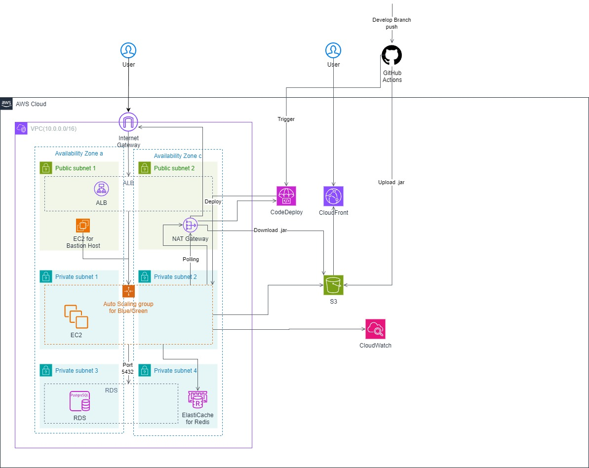

# 🏗️ System Architecture

본 프로젝트는 실제 운영 환경을 가정하여 **안정성**과 **비용 효율성**의 균형을 맞춘 AWS 클라우드 인프라를 설계했습니다.

## 1. Architecture Diagram

## 2. 설계 원칙 (Design Principles)

### 2.1. 비용 효율적인 고가용성 (Cost-Effective HA)

* **Multi-AZ 구성**: `Availability Zone a`와 `c`에 리소스를 분산 배치하여 하나의 데이터 센터에 장애가 발생하더라도 서비스가 중단되지 않도록 설계했습니다.
* **Auto Scaling Group**: 트래픽 변동에 따라 EC2 인스턴스 수를 유동적으로 조절하여, 유휴 리소스 비용을 최소화했습니다.
* **NAT Strategy**: Private Subnet의 인스턴스가 외부와 통신(Patch Update 등)할 때만 NAT Gateway를 사용하며, 비용 절감을 위해 트래픽이 적을 경우 NAT
  Instance로 대체 가능한 구조입니다.

### 2.2. 보안 강화 (Security First)

* **VPC 망 분리 (Public/Private Subnet)**:
    * **Public Subnet**: 외부에서 접근 가능한 Load Balancer(ALB)와 Bastion Host만 배치했습니다.
    * **Private Subnet**: 실제 비즈니스 로직을 수행하는 EC2와 데이터베이스(RDS, Redis)는 외부 접근이 차단된 Private Subnet에 배치하여 보안을 강화했습니다.
* **Security Group Chaining**: ALB는 80/443 포트만 허용하고, WAS(EC2)는 오직 ALB로부터 오는 트래픽만 허용하도록 보안 그룹을 체이닝했습니다.

### 2.3. 무중단 배포 (CI/CD Pipeline)

* **GitHub Actions & AWS CodeDeploy**:
    1. 개발자가 `Develop` 브랜치에 코드를 푸시하면 GitHub Actions가 빌드를 수행합니다.
    2. 빌드된 `.jar` 아티팩트는 S3 버킷에 업로드됩니다.
    3. CodeDeploy가 Trigger되어 Auto Scaling Group 내의 EC2 인스턴스에 순차적으로 배포를 진행합니다.
* **Blue/Green Deployment**: 신규 버전 배포 시 기존 트래픽을 유지하며 안전하게 전환할 수 있는 Blue/Green 배포 전략을 채택했습니다.

---

## 3. 구성 요소 상세 (Component Details)

| 구분                 | 구성 요소                   | 역할 및 설명                                                           |
|:-------------------|:------------------------|:------------------------------------------------------------------|
| **Load Balancing** | **ALB**                 | 트래픽을 여러 AZ의 EC2 인스턴스로 분산하여 부하를 조절합니다.                             |
| **Compute**        | **EC2 (ASG)**           | Spring Boot 애플리케이션이 구동되는 서버입니다. Auto Scaling을 통해 트래픽 스파이크에 대응합니다. |
| **Database**       | **RDS (PostgreSQL)**    | 관계형 데이터 저장을 위한 메인 데이터베이스입니다. (과제 구현은 H2 사용)                       |
| **Cache**          | **ElastiCache (Redis)** | 세션 정보 저장 및 자주 조회되는 데이터 캐싱을 통해 DB 부하를 줄입니다.                        |
| **Network**        | **NAT Gateway**         | Private Subnet의 인스턴스가 인터넷과 통신(아웃바운드)하기 위한 게이트웨이입니다.               |
| **Monitoring**     | **CloudWatch**          | CPU 사용량, 네트워크 트래픽 등 서버 상태를 모니터링하고 알람을 발송합니다.                      |

---

## 4. 과제 구현 vs 이상적 설계 (Reality vs Ideal)

본 과제는 제출 요건에 따라 **H2 Database(In-Memory)**를 사용하여 구현되었습니다. 하지만 실제 프로덕션 레벨에서는 데이터의 영속성과 확장성을 위해 위 아키텍처와 같이 AWS RDS(
PostgreSQL)와 ElastiCache(Redis)를 사용하는 것이 적합하다고 판단하여 설계를 제안합니다.

* **Database**:
    * **Assignment**: H2 (In-memory, Embedded) - 별도 설치 없이 실행 가능.
    * **Production**: AWS RDS (PostgreSQL) - Multi-AZ를 통한 데이터 무결성 및 백업 확보.
* **Cache**:
    * **Assignment**: Local Cache (ConcurrentHashMap 등) 또는 미적용.
    * **Production**: AWS ElastiCache (Redis) - 분산 환경에서의 세션 공유 및 고속 읽기 성능 확보.